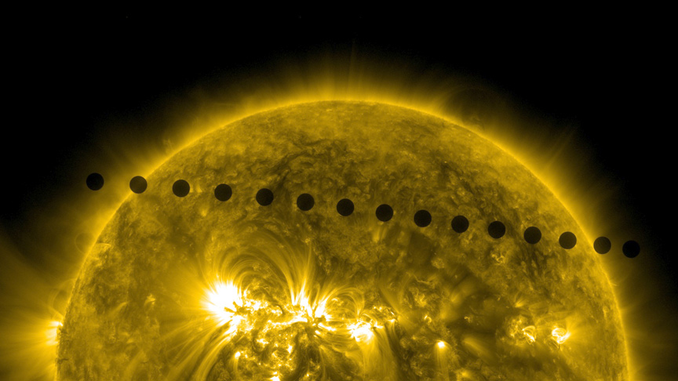

<p align="center"></p>
<h1 align="center"> Solar Dynamics Observatory Data REST API </h1>

<h3 align="center"> REST API for all public data of the Solar Dynamics Observatory</h3>

## Usage:

```
GET api.sdodata.com/v1/latest
```
```json
[
  {
    "date": "",
    "utcTime": "",
    "resolution": "2048",
    "wavelength": "0094",
    "url": "https://sdo.gsfc.nasa.gov/assets/img/latest/latest_2048_0094.jpg"
  },
  {
    "date": "",
    "utcTime": "",
    "resolution": "2048",
    "wavelength": "0131",
    "url": "https://sdo.gsfc.nasa.gov/assets/img/latest/latest_2048_0131.jpg"
  },
  ...
]
```
```
GET /api/queryProducts/20220819
```
```json
{
    "date": "20220819",
    "utcTime": "000000",
    "resolution": "1024",
    "wavelength": "HMIB",
    "url": "https://sdo.gsfc.nasa.gov/assets/img/browse/2022/08/19/20220819_000000_1024_HMIB.jpg"
}
...
```